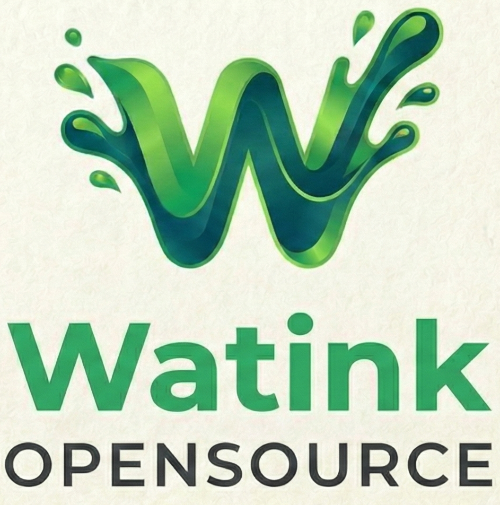

  

# 🚀 Watink OpenCore

**A plataforma open-source definitiva para escalabilidade, atendimento premium e automação inteligente no WhatsApp.**

O **Watink** é uma solução completa e robusta projetada para transformar a comunicação da sua empresa. Centralize atendimentos, automatize processos complexos e eleve a experiência do seu cliente com uma plataforma modular, rápida e extremamente estável.

---

## 🔥 Diferenciais Técnicos e Funcionalidades

O Watink OpenCore entrega nativamente tudo o que é essencial para uma operação de alto nível:

### 📱 **Central de Atendimento Multi-Agente**
*   **Número Único, Equipes Múltiplas**: Gerencie dezenas de atendentes em um único número oficial ou não-oficial.
*   **Filas e Departamentos Inteligentes**: Distribua a carga de trabalho de forma organizada (Suporte, Comercial, Financeiro).
*   **Transferência Dinâmica**: Mova conversas entre especialistas mantendo o histórico total e contexto do cliente.

### 🤖 **Flow Builder Visual de Alto Impacto**
Construa jornadas de cliente automatizadas com nosso editor avançado:
*   **Interface Drag & Drop**: Desenhe fluxos complexos sem escrever uma linha de código.
*   **Simulador em Tempo Real**: Teste o comportamento do seu bot instantaneamente antes de ir ao ar.
*   **Integrações via Webhook/API**: Conecte o Core com qualquer sistema externo (CRMs, ERPs, Gateways).
*   **Inteligência de Dados**: Utilize nós de base de conhecimento para respostas automáticas baseadas em IA.

### 💼 **CRM Kanban & Pipelines**
*   **Gestão de Funis**: Crie múltiplos pipelines para vendas, onboarding ou suporte.
*   **Automação de Etapas**: Mova cards automaticamente conforme a interação do cliente no fluxo.
*   **Agendamentos e Lembretes**: Nunca perca uma oportunidade de follow-up.

### 🎨 **Experiência Whitelabel**
*   **Personalização Total**: Altere logotipos, cores e fundos da tela de login diretamente pelo painel administrativo.
*   **Modo Dark Nativo**: Interface otimizada para produtividade em qualquer ambiente.

---

## 🏗️ Stack Tecnológica

Construído com as tecnologias mais modernas e escaláveis do mercado:
*   **Backend**: Node.js com TypeScript e Sequelize.
*   **Frontend**: React.js com Material UI e Vite.
*   **Engine**: Whaileys (Performance otimizada para WhatsApp).
*   **Banco de Dados**: PostgreSQL e Redis (Cache).
*   **Mensageria**: RabbitMQ (Filas robustas).
*   **Infraestrutura**: Totalmente Dockerizado para deploy rápido (Swarm/Compose).

---

## 📚 Central de Ajuda

Aprenda a configurar e operar o Watink com nossa documentação detalhada:

1.  📖 **[Manual do Usuário](userguide/README.md)**
2.  🔌 **[Conectando o WhatsApp](userguide/connections/CONNECTING.md)**
3.  ⚙️ **[Configurações e Whitelabel](userguide/settings/GENERAL_SETTINGS.md)**
4.  🤖 **[Guia do Flow Builder](userguide/flowbuilder/CREATING_FLOWS.md)**
5.  📊 **[Gestão de Pipelines](userguide/pipelines/USING_KANBAN.md)**

---

## 🤝 Comunidade e Suporte

O Watink vive e cresce através da sua comunidade. 

💬 **[Participe do nosso Grupo no WhatsApp](https://chat.whatsapp.com/J7HDHaTvVDr5JUOd0HE1Bj)**

---

## 🤝 Hospedagem Indicada

O Watink e um ecosistema em microserviços entao um bom servidor vai garantir a sua paz nos indicamos e apoioamos a hosteg. 

💬 **[Participe do nosso Grupo no WhatsApp](https://painelcliente.com.br/aff.php?aff=87&gid=32)**

---

  Watink OpenCore • Simples • Poderoso • Livre

